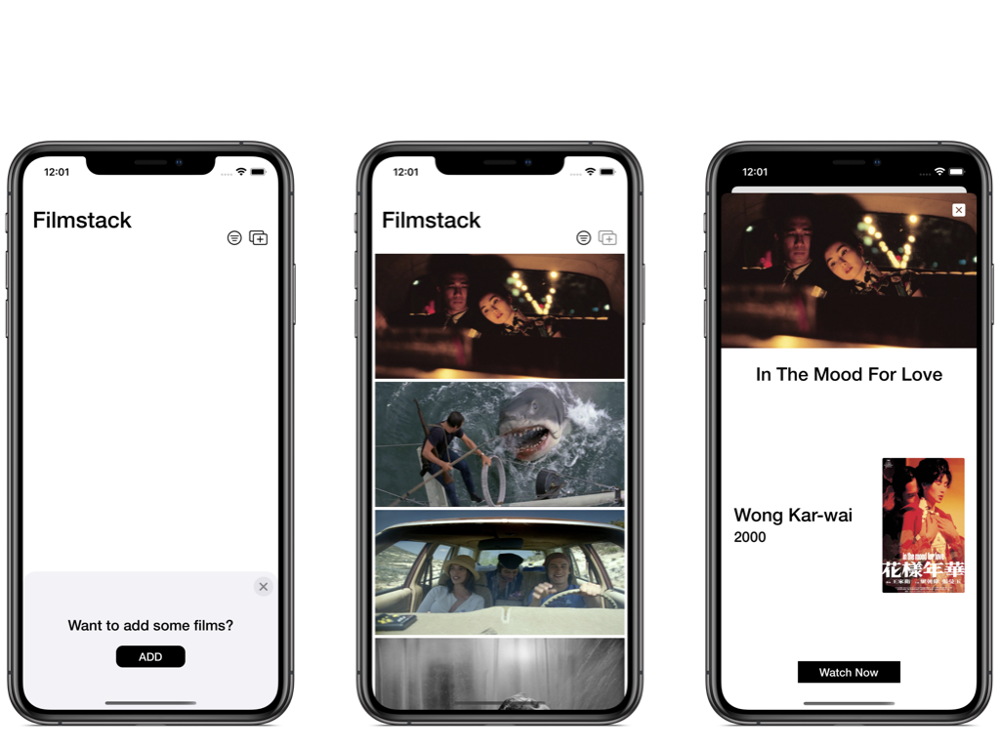

# Filmstack

* UIKit
* Diffable Data Source
* MVVM 
* [SnapKit](https://github.com/SnapKit/SnapKit) (5.0.1) 
 
This was made to practice with compositional layout, diffable data source, MVVM and SnapKit but mostly so I can display some of my favorite films in a cool way.

One of the most challenging parts of this project was planning how I wanted to present the information on the home screen. 

I switched direction of the design several times and ultimately thought it would be interesting to only show scenes of the films without context. Arguably terrible for accessibility, but on the other hand I intended this project to be viewed as a mood board with minimal explanation and a focus as a spectacle.

This was my first time using SnapKit for a larger project and have had a positive experience. I wrote an article on the gist of SnapKit and can be found here on [Medium](https://leonardoidiaz.medium.com/intro-to-snapkit-25208fa1b51c).  

<h2 align= "center"> Filmstack Screens </h2>

--- 

  

#### Acknowledgement: 
[SnapKit](https://github.com/SnapKit/SnapKit)